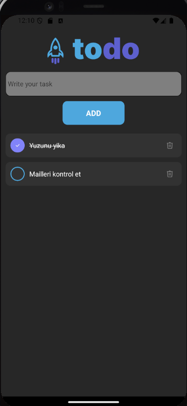

# Todo Application

This is a **Todo application** built using Expo.

## Design Source

This application was inspired by the following Figma design:

[**ToDo List (Community)**](https://www.figma.com/design/KZUSiAMv3YaqB4ZVjTGque/ToDo-List-%F0%9F%91%85-(Community)?node-id=0-1&node-type=canvas&t=g8FWNznrjRFNrJas-0)

## Screenshot

  

